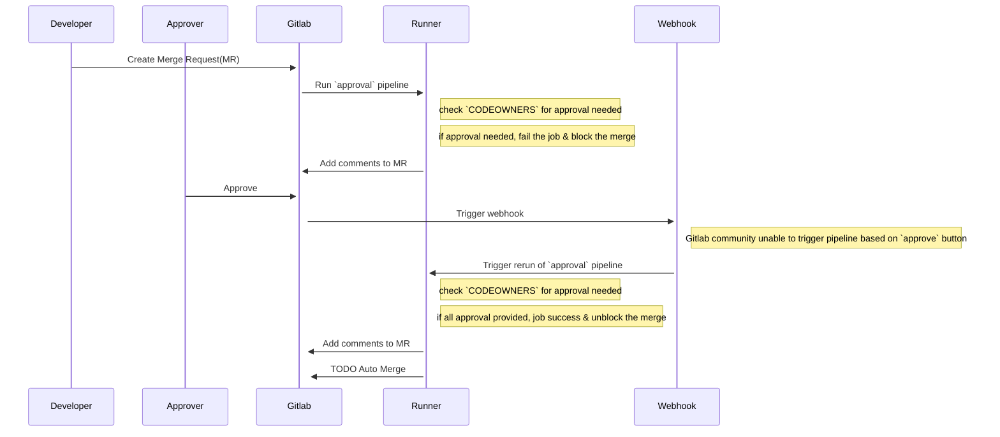

# Concepts

```mermaid
sequenceDiagram
    participant Developer
    participant Approver
    Developer->>+Gitlab: Create Merge Request(MR)
    Gitlab->>+Runner: Run `approval` pipeline
    Note right of Runner: check `CODEOWNERS` for approval needed
    Note right of Runner: if approval needed, fail the job & block the merge
    Runner->>+Gitlab: Add comments to MR
    Approver->>+Gitlab: Approve
    Gitlab->>+Webhook: Trigger webhook
    Note right of Webhook: Gitlab community unable to trigger pipeline based on `approve` button
    Webhook->>Runner: Trigger rerun of `approval` pipeline
    Note right of Runner: check `CODEOWNERS` for approval needed
    Note right of Runner: if all approval provided, job success & unblock the merge
    Runner->>+Gitlab: Add comments to MR
    Runner->>+Gitlab: TODO Auto Merge
```

